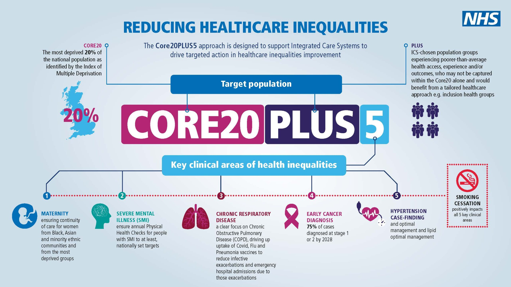

<!-- README.md is generated from README.Rmd. Please edit that file -->

# Evaluation of the Core20PLUS5 approach

<!-- badges: start -->
<!-- badges: end -->

The goal of this project is to provide a descriptive analysis of
hypertension metrics available from the CVDPREVENT audit website, as
part of a wider evaluation of the Core20PLUS5 approach.

## Using this Repo

All data used in this analysis is within the public domain.

The analysis uses the R language and has been written into a
[Quarto](https://quarto.org/docs/computations/r.html) .html document.

The recommended approach to re-create the analysis is:

1.  Install dependencies,
2.  Ensure necessary folder structure
3.  Gather the data from the CVDPREVENT application programming
    interface (API),
4.  Render the Quarto document.

### 1. Installing dependencies

Run the [`get_dependencies.R`](scripts/get_dependencies.R) script to
identify the packages used within this analysis. NB, this file requires
at least `renv`, `janitor` and `dplyr` to first be installed on your
system to run.

### 2. Folder structure

Run the [`set_folders.R`](scripts/set_folders.R) script to ensure the
necessary folder structure is in place to receive data.

### 3. Gather the data

Run the [get_cvdprevent_data.R](scripts/get_cvdprevent_data.R) script to
download the hypertension indicator data from the CVDPREVENT API.

This script downloads indicator data at England and at Integrated Care
Board (ICB) levels and over all time periods for which data is
available. ⌛ This process may take a few minutes.

You will likely receive messages in your console during this download
process about data not being available. This is to be expected as some
indicator data is not available for all time periods.

### 4. Render the Quarto document

Open the [`hyp_eda_wip.qmd`](outputs/hyp_eda_wip.qmd) quarto file.

If this is your first time, then ensure the parameter
`flag_calc_expensive_operations` is set to `TRUE`, as below:

``` yaml
params:
  # should expensive calculations be re-calculated?
  # default = FALSE. Set to TRUE if running for the first time
  flag_calc_expensive_operations: TRUE
```

Setting to `TRUE` will ensure some essential, but computationally heavy,
calculations are performed and the results stored in your `data` folder.

Once the file is rendered the [analysis](outputs/hyp_eda_wip.html) file
can be found in the outputs folder. Your IDE may open this file for you
automatically.

# About the evaluation

The Strategy Unit has been commissioned by the Healthcare Inequalities
Improvement Programme (HiQiP) team to evaluate the Core20PLUS5 approach.
The evaluation will be longitudinal and mixed methods and will examine
changes on both process and outcomes. Scoping activities for the
evaluation took place January-June 2024. Work on the evaluation
commenced in October 2024 following sign-off for both the evaluation
framework and a high-level evaluation delivery plan.

The programme theory for the Core20PLUS5 approach, which is being tested
through the evaluation is **whether a national approach to tackling
healthcare inequalities** - which focuses on specific population groups
and clinical areas - **can provide a structured approach to achieving
equitable access, provide excellent experience, and deliver optimal
outcomes for all**.

The focus of this quantitative element of the evaluation is around
**hypertension**.

### About this repo

This repo supports collaboration of work to provide a descriptive
analysis of indicators of hypertension prevalence and care across
England from the [CVDPREVENT audit](https://www.cvdprevent.nhs.uk/)
website.

<table>
<caption>Hypertension indicators to be analysed</caption>
<colgroup>
<col style="width: 4%" />
<col style="width: 95%" />
</colgroup>
<thead>
<tr class="header">
<th style="text-align: left;">Indicator code</th>
<th style="text-align: left;">Description</th>
</tr>
</thead>
<tbody>
<tr class="odd">
<td style="text-align: left;">CVDP001HYP</td>
<td style="text-align: left;"><p><strong>Hypertension:
Prevalence</strong></p>
<p>Prevalence of GP recorded hypertension and no subsequent recorded
hypertension resolution, in patients aged 18 and over</p></td>
</tr>
<tr class="even">
<td style="text-align: left;">CVDP002HYP</td>
<td style="text-align: left;"><p><strong>Hypertension: Treated to
appropriate threshold (age &lt; 80)</strong></p>
<p>The percentage of patients aged 18 to 79 years with GP recorded
hypertension, in whom the last clinic blood pressure (BP) or equivalent
home or ambulatory blood pressure reading (measured in the preceding 12
months), is to the age and setting appropriate treatment
threshold.</p></td>
</tr>
<tr class="odd">
<td style="text-align: left;">CVDP003HYP</td>
<td style="text-align: left;"><p><strong>Hypertension: Treated to
appropriate threshold (age &gt;= 80)</strong></p>
<p>The percentage of patients aged 80 years or over, with GP recorded
hypertension, in whom the last clinic blood pressure (BP) or equivalent
home or ambulatory blood pressure reading (measured in the preceding 12
months), is to the age and setting appropriate treatment
threshold.</p></td>
</tr>
<tr class="even">
<td style="text-align: left;">CVDP004HYP</td>
<td style="text-align: left;"><p><strong>Hypertension: BP
monitoring</strong></p>
<p>The percentage of patients aged 18 and over with GP recorded
hypertension, with a record of a blood pressure reading in the preceding
12 months.</p></td>
</tr>
<tr class="odd">
<td style="text-align: left;">CVDP005HYP</td>
<td style="text-align: left;"><p><strong>Hypertension: High risk – one
high BP with no recorded hypertension</strong></p>
<p>The percentage of GP registered patients aged 18 and over with a
single blood pressure reading of systolic &gt;=140mmHg and diastolic
&gt;=90mmHg (indicating increased risk of hypertension), but with no
hypertension diagnosis (and no recorded hypertension resolution) in the
GP record. The single high blood pressure reading is recorded more than
3 months prior to the audit end date.</p></td>
</tr>
<tr class="even">
<td style="text-align: left;">CVDP006HYP</td>
<td style="text-align: left;"><p><strong>Hypertension: Potential
antihypertensive overtreatment</strong></p>
<p>The percentage of patients 18 and over with GP recorded hypertension,
prescribed antihypertensive medication in whom the last systolic blood
pressure (BP) reading was low (&lt;=100mmHg) who have been prescribed
antihypertensive medications after the date of the low systolic BP
value.</p></td>
</tr>
<tr class="odd">
<td style="text-align: left;">CVDP007HYP</td>
<td style="text-align: left;"><p><strong>Hypertension: Treated to
appropriate threshold (all ages)</strong></p>
<p>The percentage of patients aged 18 and over with GP recorded
hypertension, in whom the last clinic blood pressure (BP) or equivalent
home or ambulatory blood pressure reading (measured in the preceding 12
months), is to the age and setting appropriate treatment
threshold.</p></td>
</tr>
<tr class="even">
<td style="text-align: left;">CVDP009HYP</td>
<td style="text-align: left;"><p><strong>Hypertension: Monitoring with
ACR</strong></p>
<p>The percentage of patients aged 18 and over, with GP recorded
hypertension (excluding patients with chronic kidney disease (CKD) (G3a
to G5)), with a record of a urine albumin:creatinine ratio (ACR) or
protein:creatinine ratio (PCR) test in the preceding 12 months.</p></td>
</tr>
</tbody>
</table>

Hypertension indicators to be analysed

### About Core20PLUS5

[Core20PLUS5](https://www.england.nhs.uk/about/equality/equality-hub/national-healthcare-inequalities-improvement-programme/core20plus5/)
is an approach designed by the Healthcare Inequalities Improvement
Programme (HiQiP) team at NHS England to reduce healthcare inequalities.
Developed between 2021 and 2022, it is intended to influence practice at
a national, regional and system level.

The approach focuses on the most deprived 20% of the population and
locally determined ‘PLUS’ groups who experience barriers to accessing
healthcare.

It highlights five clinical areas which require accelerated improvement.
For adults, these are maternity, severe mental illness, chronic
respiratory disease, early cancer diagnosis and hypertension case
finding. For children and young people, these are asthma, diabetes,
epilepsy, oral health and mental health.

<figure>

<figcaption aria-hidden="true">Infographic outlining the components of
the Core20PLUS5 approach in adults</figcaption>
</figure>

# 
